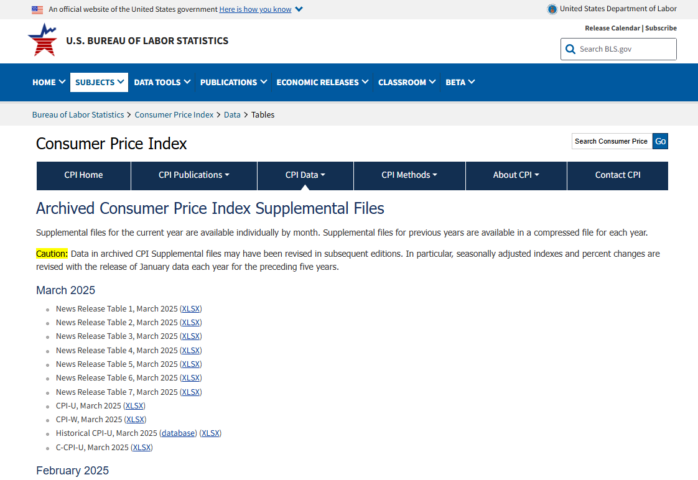
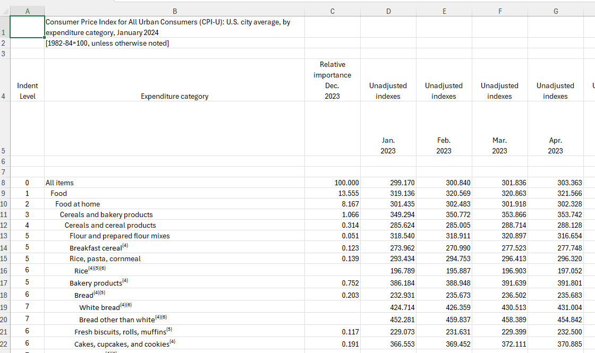
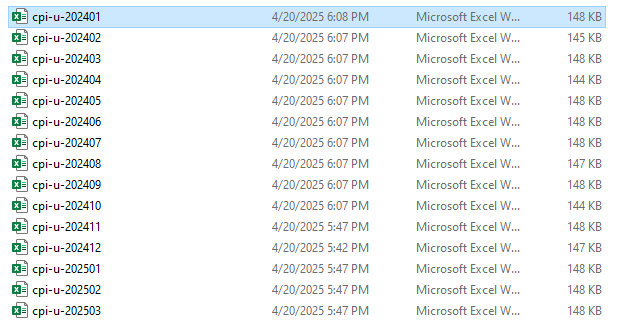
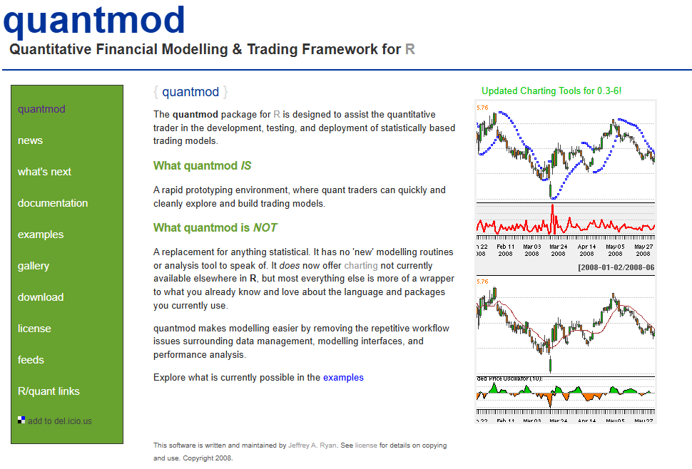

# Introduction

To be in a recession or not to be in a recession—that is the question people have been asking, especially with economic indicators often being blown out of proportion. History shows that while officials may claim we aren’t in one, we usually don’t realize we’re in a recession until it’s already behind us and the hardest part is over.

Today, we won’t be deciding whether or not we’re in a recession. Instead, we’re going to take a look at what’s happening in the market. Consumers continue to report that prices are steadily rising, and to explore that, I’ve chosen two key questions to investigate.

### What are these questions you may ask?

-   How has the Consumer Price Index for All Urban Consumers (CPI-U) changed over the past year and beyond?

-   What trends are we seeing in the stock market, and what might they indicate about broader economic conditions?

# Global Market Overview ***(Cool interactive widget)***

```{=html}

<div class="tradingview-widget-container">
  <div class="tradingview-widget-container__widget"></div>
  <div class="tradingview-widget-copyright">
    <a href="https://www.tradingview.com/" rel="noopener nofollow" target="_blank">
      <span class="blue-text">Track all markets on TradingView</span>
    </a>
  </div>
  <script type="text/javascript" src="https://s3.tradingview.com/external-embedding/embed-widget-market-overview.js" async>
  {
    "colorTheme": "light",
    "dateRange": "12M",
    "showChart": true,
    "locale": "en",
    "largeChartUrl": "",
    "isTransparent": false,
    "showSymbolLogo": true,
    "showFloatingTooltip": false,
    "width": "100%",
    "height": "550",
    "tabs": [
      {
        "title": "Indices",
        "symbols": [
          { "s": "FOREXCOM:SPXUSD", "d": "S&P 500 Index" },
          { "s": "FOREXCOM:NSXUSD", "d": "US 100 Cash CFD" },
          { "s": "FOREXCOM:DJI", "d": "Dow Jones Industrial Average Index" },
          { "s": "INDEX:NKY", "d": "Japan 225" },
          { "s": "INDEX:DEU40", "d": "DAX Index" },
          { "s": "FOREXCOM:UKXGBP", "d": "FTSE 100 Index" }
        ]
      },
      {
        "title": "Forex",
        "symbols": [
          { "s": "FX:EURUSD", "d": "EUR to USD" },
          { "s": "FX:GBPUSD", "d": "GBP to USD" },
          { "s": "FX:USDJPY", "d": "USD to JPY" },
          { "s": "FX:USDCHF", "d": "USD to CHF" },
          { "s": "FX:AUDUSD", "d": "AUD to USD" },
          { "s": "FX:USDCAD", "d": "USD to CAD" }
        ]
      }
    ]
  }
  </script>
</div>

```

Above is an interactive stock widget that lets you explore live market data. The goal was to give you a fun and engaging way to view stock trends and get a sense of the market with up-to-date information.

Through this, I also learned how to embed HTML directly into an R Markdown document using an HTML code chunk. I found the widget on [tradingview.com](https://www.tradingview.com). then adjusted the code so it would work properly when knitting the file to HTML (shoutout to Google for the assist).

## Libraries Needed

```{r message=FALSE, warning=FALSE}

library(quantmod)
library(readxl)
library(tidyverse)
library(ggplot2)

## If you need to install them
## install.packages("quantmod")
## install.packages("readxl")
## install.packages("tidyverse")
## install.packages("ggplot2")

```

### So Where do we start?

The first challenge we face is: where are we going to get our data?

We’re looking for information on the CPI-U, which stands for the Consumer Price Index for All Urban Consumers. This index helps us understand how prices are changing for everyday consumers.

With that in mind, there’s one source that provides the most accurate and reliable statistics for this: [The Bureau of Labor Statistics](https://www.bls.gov/)

By searching for CPI on the site, you’ll find all kinds of information and brief articles. However, what we’re looking for is the main CPI homepage.

Once there, navigate to Data Tools and select Tables. It should look something like this:

---



---

The data we are wanting to extract is from the CPI-U in each month and download the xlsx file.

when opened it should look like this:

---



---

#### **This is great!**

But this is a lot of information and data to intake so we want to first cut this up and combined it all into one nice big set of data that we can use!

### Data Cleaning: The Pre Reading Process

The most important pieces of data from these charts are the "Relative Importance (Month)" column and the "Expenditure Category" column.

First, I cleaned up the Expenditure Category column by removing all the small superscript notes like <sup>(1)(2)(3)...(11)</sup> from the Excel file. This was easily done using a simple Find & Replace.

Next, I copied the Relative Importance (Month) columns from each of the raw data files. I went through them one by one, which ended up taking more time than I expected—I didn’t want to import 14 separate Excel files into RStudio, especially since they all had such similar names.

I mean, just look at how similar they are:

---



---

So once i had completed my file we got to do our first set of R Studio coding on this project!!!

```{r Reading Data In}

## reading the data file into r studio
cpi_u_data_raw <- read_excel("Data/CPI_U_DATA.xlsx")

```

Now that I had the file imported and properly named, I could begin manipulating the data to better suit my goal: creating simple time series plots.

### Before building the time series plots, I completed three key steps:

**1) Removed all N/A values**

These rows weren’t relevant to my analysis and could potentially cause issues later on. To avoid unnecessary complications, I decided to remove them upfront so I could focus on the data that actually mattered.

```{r Remove N/A}

## Removing all N/A values and rows as they wont be providing much to an analysis and would just get in the way
cpi_u_data_no_na <- na.omit(cpi_u_data_raw)

```

**2) Removed the raw data file**

Because i removed the N/A values i also wanted to keep my workspace clean and removed it from the file.

```{r Remove Raw Data}

## removing raw data so i keep my r studio clean and don't accidentally use the wrong data set
rm(cpi_u_data_raw)

```

This brings us to the final step before creating our plots:

**3) Change the column Names**

Each column originally had names with spaces, which made it difficult to reference them in code. To fix this, I decided to rename each column using the corresponding month and year from its original name.

The code below takes the existing column names and replaces them with simplified, consistent labels—so something like "Relative Importance (Month)" becomes "Mth_Year".

```{r Rename Columns}

## renaming columns to better align with the dates and to be more usable
names(cpi_u_data_no_na) <- c(
  "Expenditure_category",
  "Dec_2023",
  "Jan_2024",
  "Feb_2024", 
  "Mar_2024",
  "Apr_2024",
  "May_2024",
  "Jun_2024",
  "Jul_2024",
  "Aug_2024",
  "Sep_2024",
  "Oct_2024",
  "Nov_2024",
  "Dec_2024",
  "Jan_2025",
  "Feb_2025" )

```

With our data now cleaned and organized, we can finally begin creating the time series plots.

First, I wanted to select three key industries that might give us insight into how consumers are experiencing the market. The categories I chose were:

- "Food at home"

- "New and used motor vehicles"

- "Household furnishings and operations"

These categories were chosen because they represent essential areas of consumer spending. "Food at home" reflects everyday cost-of-living pressures, "motor vehicles" are big-ticket items that can signal consumer confidence, and "household furnishings" often rise or fall with economic comfort and disposable income.


```{r message=FALSE, warning=FALSE}

## Clean data being assigned to a timeseries variable which is piped into a filter that filters Expenditure_category where we keep only the three chosen expenditure categories
cpi_timeseries <- cpi_u_data_no_na %>%
  filter(Expenditure_category %in% c(
    "Food at home", 
    "New and used motor vehicles", 
    "Household furnishings and operations")) %>%
  
## This reshapes data into long format vs wide format, excludes expenditure_category, creating a month_year column based on column name, puts each corresponding value into cpi_value
  pivot_longer(
    cols = -Expenditure_category,
    names_to = "month_year",
    values_to = "cpi_value") %>%
  
## this makes the date column from the month_year string by converting to a date object.
  mutate(
    date = as.Date(paste0("01_", month_year), format = "%d_%b_%Y"))

```

### Lets Plot!


*First up is the Food timeseries:*

---

```{r message=FALSE}

# Filter data for "Food at home" and map date to x-axis, CPI to y-axis.
food_timeseries <- ggplot(
  filter(cpi_timeseries, Expenditure_category == "Food at home"),
  aes(x = date, y = cpi_value)) +
  
# Add a blue line plot of CPI values over time, also added a smooth dashed trend line below and gave the x axis and y axis titles.
  geom_line(color = "#6baed6", linewidth = 0.8) +
  geom_smooth(method = "loess", se = FALSE, color = "#7f8c8d", linetype = "dashed") +
  labs(title = "Food at Home CPI", x = "Date", y = "CPI Value") +
  
# Apply a minimal theme and center the title to look better.
  theme_minimal() +
  theme(plot.title = element_text(hjust = 0.5, face = "bold", size = 12))


food_timeseries

```

---

This graph shows a steady decline in the Consumer Price Index (CPI) for "Food at Home" from early 2024 to early 2025, dropping from around 8.17 to 8.03. The sharpest decrease occurs in the first half of 2024, followed by a period of stabilization with minor fluctuations through the rest of the year. This trend suggests a consistent reduction in the cost of food items purchased for home consumption.

Several factors may explain this decline. Lower production and transportation costs, possibly due to falling fuel prices or improved supply chains, can reduce overall food prices. Additionally, weakened consumer demand, increased market competition among retailers, or favorable government policies like subsidies or tax cuts could also contribute to this downward trend in food-at-home CPI.


*Second up is the Car timeseries:*

---

```{r message=FALSE}

# Filter data for "New and used motor vehicles" and map date to x-axis, CPI to y-axis.
car_price_timeseries <- ggplot(
  filter(cpi_timeseries, Expenditure_category == "New and used motor vehicles"),
  aes(x = date, y = cpi_value)) +

# Add a green line plot of CPI values over time, a dashed trend line, and x and y axis labels.
  geom_line(color = "#90EE90", linewidth = 0.8) +  
  geom_smooth(method = "loess", se = FALSE, color = "#7f8c8d", linetype = "dashed") +
  
# Add a vertical line on November 1st, 2024 to highlight the change in CPI that stood out
  geom_vline(xintercept = as.Date("2024-11-01"),color = "#FF7F50",linewidth = 0.8) +
  labs(title = "Motor Vehicles CPI",x = "Date",y = "CPI Value") +

  # Apply a minimal theme and center the title to look better.
  theme_minimal() +
  theme(plot.title = element_text(hjust = 0.5, face = "bold", size = 12))

car_price_timeseries

```
---

This graph displays the Consumer Price Index (CPI) for New and Used Motor Vehicles from late 2023 through early 2025. For most of 2024, the CPI trends slightly downward or remains flat, reflecting stable or mildly decreasing vehicle prices. However, beginning around November 2024, there is a sharp and sudden rise in CPI values, indicating a rapid increase in the cost of motor vehicles. The vertical orange line marks November 1st, 2024, which appears to coincide with a significant event that may have influenced this change.

That red line is more than just a date—it likely represents the 2024 U.S. presidential election, a major event that can have broad economic implications. The auto market, like many sectors, may have reacted quickly to the uncertainty or anticipated policy shifts associated with a new administration or congressional changes. 

Factors such as potential changes to tariffs, environmental regulations, or interest rates could all play a role in how the market responds. 


*Last up is the Furnishing timeseries:*

---

```{r message=FALSE}

# Filter data for "Household furnishings and operations" and map date to x-axis, CPI to y-axis.
furnishings_timeseries <- ggplot(filter(cpi_timeseries, Expenditure_category == "Household furnishings and operations"),
  aes(x = date, y = cpi_value)) +

# Add an orange line plot of CPI values over time and overlay a dashed smoothed trend line and label the axes.
  geom_line(color = "#FFC154", linewidth = 0.8) +
  geom_smooth(method = "loess", se = FALSE, color = "#7f8c8d", linetype = "dashed") +
  labs(title = "Household Furnishings CPI",x = "Date",y = "CPI Value") +
  
# Set the title and axis labels, use a minimal theme, and center the title.
  theme_minimal() +
  theme(plot.title = element_text(hjust = 0.5, face = "bold", size = 12))

furnishings_timeseries

```

---

The graph illustrates the Consumer Price Index (CPI) for Household Furnishings from January 2024 to January 2025, showing a clear downward trend in prices over the year. The CPI begins at a relatively high level, around 4.52, and drops steadily through April 2024. This sharp decline suggests a significant market shift, possibly driven by reduced consumer demand, changes in supply chain dynamics, or policy influences such as the de-escalation of threatened tariffs.

From mid-2024 onward, the CPI appears to stabilize, with minor fluctuations around the 4.40 level. This plateau indicates that prices found a new equilibrium after the earlier drop. Temporary increases during the summer months might reflect seasonal demand, but the overall trend remains flat through the end of the year.

---

## To answer the question

-   How has the Consumer Price Index for All Urban Consumers (CPI-U) changed over the past year and beyond?


The Food at Home CPI showed a consistent downward trend from early 2024 to early 2025, pointing to a gradual reduction in grocery prices. This decline may reflect easing inflationary pressures driven by improved supply chains, lower transportation costs, or shifts in consumer spending. By mid-year, the CPI stabilized, suggesting that the market had adjusted to post-inflation conditions.

In the Motor Vehicles category, prices remained relatively stable for most of the year before spiking sharply around November 2024. This sudden increase likely corresponds with a significant macroeconomic event, such as the U.S. presidential election, which may have introduced new uncertainties or anticipated regulatory changes. The auto market's reaction highlights how sensitive certain sectors are to political and economic developments.

The Household Furnishings CPI followed a similar path to food, with a noticeable drop early in the year followed by relative stability. This trend indicates a potential normalization in prices after earlier inflation, likely supported by lower input costs or stronger supply chain resilience. Unlike vehicles, this sector experienced less volatility later in the year, reinforcing the idea of a settling market.

Taken together, these trends suggest a broader pattern of cooling inflation across many consumer sectors, though not uniformly. While food and furnishings appear to have stabilized after price declines, the motor vehicle sector illustrates that some categories remain reactive to external shocks. This paints a nuanced picture of the CPI-U, showing both progress in price stability and the lingering potential for disruption.

---


#### Analyzing Stock Market Trends and Economic Signals

Before diving in, let's take a moment to understand what [Quantmod](https://www.quantmod.com/) is.


The site says:

---



---

Quantmod is a great tool for pulling in financial data, especially for stocks. As the site notes, it's designed with quantitative traders in mind, making it a solid fit for this type of analysis.

To begin collecting data, we first define a specific time frame. I chose to end the range on April 20th, which helps keep the analysis current without including data that's so recent it may still be incomplete or volatile. This way, we strike a balance between being up-to-date and maintaining data reliability.

---

```{r Intaking S&P Data}

# Set custom date range for pulling stock data
start_date <- as.Date("2024-01-01")
end_date <- as.Date("2025-04-20")

# Fetch S&P 500 data from Yahoo Finance
getSymbols("^GSPC", src = "yahoo", from = start_date, to = end_date)

# Create a dataframe with dates and adjusted closing prices to ensure true value.
sp500_data <- data.frame(date = index(GSPC),adjusted_close = as.numeric(GSPC$GSPC.Adjusted))

head(sp500_data)
tail(sp500_data)

```

---

We are going to repeat this proccess for two stocks besides the S$P, Tesla & Apple.

while tesla is a big fluctuator it stil will provide useful as the market always seems to be looking into the company and doesnt have a real concreet value of it especially with the recent election.

---

```{r Intaking TESLA Data, message=FALSE, warning=FALSE, results='hide'}

# Download historical Tesla stock data from Yahoo Finance
getSymbols("TSLA", src = "yahoo", from = start_date, to = end_date)

# Create a dataframe with dates and Tesla adjusted closing prices to ensure true value.
tsla_data <- data.frame(date = index(TSLA),tsla_adjusted = as.numeric(TSLA$TSLA.Adjusted))

head(tsla_data)
tail(tsla_data)
```

```{r Intaking APPLE Data, message=FALSE, warning=FALSE, results='hide'}

# Download historical Apple stock data from Yahoo Finance
getSymbols("AAPL", src = "yahoo", from = start_date, to = end_date)

# Create a dataframe with dates and Apple adjusted closing prices to ensure true value.
aapl_data <- data.frame(date = index(AAPL),aapl_adjusted = as.numeric(AAPL$AAPL.Adjusted))

head(aapl_data)
tail(aapl_data)
```

---

Now that we’ve imported our stock data into their respective data frames, we’re going to create a few new variables. These will be useful when building a more complex linear model later on.

One of these variables is the VIX, which measures expected market volatility over the next 30 days. When the VIX spikes, it usually indicates that investors are feeling uncertain about the market. I’m including it because it could provide additional insight—if the VIX turns out to significantly affect certain companies’ returns, it might reveal something deeper about overall market sentiment.

Another important variable is a tariff indicator. Many recent market shifts have been driven by new tariffs or the threat of them, which can drastically alter how companies operate. Because of this, both the VIX and the tariff variable could be closely related. I’ll need to check for multicollinearity between them. The goal of this tariff variable is to capture how these policy changes might be influencing market behavior and returns.

---

```{r Intaking VIX Data, message=FALSE, warning=FALSE, results='hide'}

# Download VIX (volatility index) data from Yahoo Finance
getSymbols("^VIX", from = start_date, to = end_date)

# Create a dataframe with dates and VIX closing valuesto ensure true value.
vix_data <- data.frame(date = index(VIX),vix = as.numeric(VIX$VIX.Close))
  
```

```{r Tariff Variable, message=FALSE, warning=FALSE, results='hide'}

# Define tariff event dates
tariff_dates <- as.Date(c(
  "2024-04-03",  # Auto tariffs
  "2024-04-02",  # Broad 10% tariffs
  "2024-03-26",  # Auto tariff announcement
  "2024-03-12",  # Steel tariffs
  "2024-02-01"   # Initial executive order
))
  
```

---

The tariff variable is based on a timeline I found on the [NBS NEWS](https://www.nbcnews.com/business/economy/tariff-timeline-trump-trade-war-global-economy-rcna196487) website. I selected key dates from this timeline based on their potential to significantly impact the market—whether by causing disruptions or offering possible benefits.

With all our variables made i now want to create a new column in each stock that has its returns, that being its closinhg value divided by its previous closing value:

---

```{r Returns Calculation}

## this takes one days returns and then divides it by the returns of the day before giving you the returns you had that day.
sp500_data$sp500_returns <- c(NA, diff(sp500_data$adjusted_close) / sp500_data$adjusted_close[-nrow(sp500_data)])
tsla_data$tsla_return <- c(NA, diff(tsla_data$tsla_adjusted) / tsla_data$tsla_adjusted[-nrow(tsla_data)])
aapl_data$aapl_return <- c(NA, diff(aapl_data$aapl_adjusted) / aapl_data$aapl_adjusted[-nrow(aapl_data)])

```

---

Now lets create one final table that we can use to perform all of our modeling and plotting we will do.


---

```{r Merging into one table}

# Single pipeline to merge all data + add new variables and rename ones to better fit for consistency
stock_data <- sp500_data %>%
  rename(sp500_price = adjusted_close) %>%
  full_join(
    tsla_data %>% rename(tsla_price = tsla_adjusted),
    by = "date"
  ) %>%
  full_join(
    aapl_data %>% rename(aapl_price = aapl_adjusted),
    by = "date"
  ) %>%
  left_join(vix_data, by = "date") %>%
  mutate(
    tariff_variable = ifelse(date %in% tariff_dates, 1, 0)  # Add tariff dummy
  ) %>%
  arrange(date)

## taking out any N/A values from the joins
stock_data <- na.omit(stock_data)

head(stock_data)

```

---

We now get a sense of what table we are working with and how we are going to be able to use it to answer our question.

Lets start with some simple plots showing a price comparison or tesla and apple:

---

```{r Stock Price Comparison}

## creating a line plot that shows teslas compared to apples price over time.
ggplot(stock_data, aes(x = date)) +
  geom_line(aes(y = tsla_price, color = "Tesla")) +
  geom_line(aes(y = aapl_price, color = "Apple")) +
  labs(title = "Stock Prices (2024-2025)", y = "Price")

```

---

The graph displays the stock prices of Apple and Tesla from early 2024 to early 2025. Apple’s stock shows relatively steady growth with moderate fluctuations, peaking slightly above $250 before dipping early in 2025. Tesla, on the other hand, exhibits much higher volatility, with prices starting below $250, spiking sharply to nearly $500 in early 2025, and then dropping steeply.

Tesla’s price movement suggests speculative trading or reactions to major events, while Apple’s more stable trend implies consistent investor confidence. Despite Tesla's dramatic rise and fall, it ends the period still above its early 2024 level, whereas Apple’s closing price is roughly similar to its starting point, reflecting a more conservative performance. This contrast highlights the differing risk profiles of the two stocks.

---

```{r S&P Price}
## creating a line plot that shows S&P500 price over time.
ggplot(stock_data, aes(x = date)) +
geom_line(aes(y = sp500_price, color = "S&P500")) +
labs(title = "S&P500 Stock Price", y = "Price")

```

---

The chart illustrates the S&P 500 index performance from early 2024 to early 2025. The index shows a strong upward trend for most of 2024, reaching a peak just before 2025, followed by a sharp decline in early 2025. Despite the drop, the index remains higher than its starting point, indicating overall growth during the period.

The steep decline in early 2025 suggests a potential market correction or reaction to macroeconomic events. While the S&P 500 generally reflects broader market sentiment, this dip may have influenced or been influenced by the volatility seen in individual stocks like Tesla or Apple as both had a similar downturn and are apart of the Magnificent 7.

#### Regresson Models

Let’s now proceed with building our regression models for both Tesla and Apple.

These models aim to predict stock returns using three explanatory variables: tariffs, S&P 500 returns, and the VIX index.

---

```{r Tesla Linear Model}
## This code fits a linear regression model for Tesla returns using tariffs, S&P 500 returns, and VIX
tesla_lm <- lm(tsla_return ~ tariff_variable + sp500_returns + vix, data = stock_data)

## summary output for analysis
summary(tesla_lm)
car::vif(tesla_lm)

```

---

The regression model for Tesla returns shows that the S&P 500 returns have a strong and statistically significant positive relationship with Tesla’s returns (p < 2e-16), with a coefficient of approximately 2.33. This indicates that Tesla’s stock is highly sensitive to broader market movements. In contrast, neither the tariff variable nor the VIX index shows a statistically significant impact on Tesla returns, suggesting those factors have minimal predictive power for this stock in this model.

The model’s R-squared value of 0.3611 means it explains about 36% of the variability in Tesla returns, which is moderate but not especially high. The residual standard error of 0.03481 indicates a fair amount of volatility in returns that the model doesn't account for. Overall, Tesla’s performance appears to be driven primarily by market sentiment, as captured by the S&P 500, rather than by tariff policies or volatility levels.

---

```{r Apple Linear Model}

## This code fits a linear regression model for Apple returns using tariffs, S&P 500 returns, and VIX
aapl_lm <- lm(aapl_return ~ tariff_variable + sp500_returns + vix, data = stock_data)

## summary output for analysis
summary(aapl_lm)
car::vif(aapl_lm)
```

---

For Apple, the regression model also highlights a strong, positive, and statistically significant effect from the S&P 500 returns (coefficient ~1.20, p < 2e-16), confirming that Apple's stock closely tracks the broader market as well. The tariff variable and VIX again show no statistically significant impact, although the VIX comes closer to significance (p = 0.102), which might suggest a mild sensitivity to market volatility.

Apple’s model explains a greater portion of the variance in returns, with an R-squared of 0.517. Additionally, the residual standard error is notably lower at 0.01328, indicating the model fits Apple's data better than Tesla's. This suggests Apple’s returns are more stable and predictable based on these macroeconomic indicators.

---

Both models agree that the S&P 500 returns are a powerful predictor of individual stock returns, reflecting the heavy influence of market-wide movements on both companies. They also consistently show that the tariff variable and the VIX are not statistically significant, suggesting that these macroeconomic indicators may not directly drive daily return fluctuations for either stock in the observed period.

However, the models differ in the degree of responsiveness and predictability. Tesla's returns are more volatile and respond more dramatically to the S&P 500 (with a coefficient nearly double Apple’s), indicating a more aggressive beta. In contrast, Apple exhibits more stable and predictable behavior, with a better-fitting model and lower error, reflecting its more consistent performance relative to market shifts.


## To answer the question Part 2

-   What trends are we seeing in the stock market, and what might they indicate about broader economic conditions?


The S&P 500 showed strong growth through most of 2024, followed by a sharp decline in early 2025. This trend suggests initial economic optimism, potentially due to solid earnings or investor confidence, shifting toward concern over broader issues like inflation, interest rates, or global instability.

Tesla’s stock was highly volatile and strongly influenced by the S&P 500, with a large coefficient in its regression model. This suggests Tesla investors are more reactive to overall market sentiment, and the stock may be more prone to speculative trading and rapid swings.

Apple, on the other hand, exhibited steadier performance with lower volatility and a better model fit. Its returns were also driven by the S&P 500 but in a more controlled and predictable manner, pointing to consistent investor confidence and less speculative behavior.

Overall, both companies’ returns were strongly tied to market-wide trends, while tariffs and the VIX had little impact. This indicates that, during this period, investors were primarily focused on general market momentum rather than specific economic risks.


